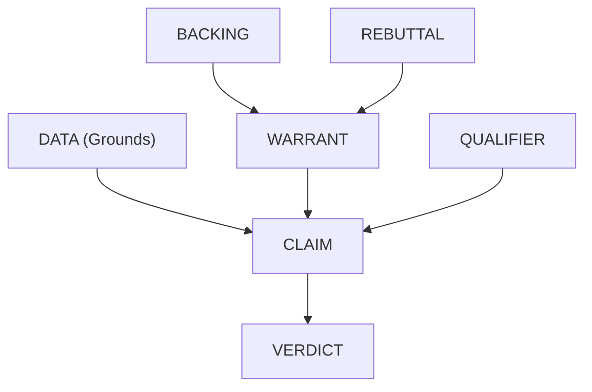

# Toulmini

[](https://toulmini.web.app)
[](https://github.com/Hmbown/Toulmini)
[](https://pypi.org/project/toulmini/)

> "The purpose of an argument is not to establish the truth of a conclusion, but to justify the right to hold it." — Stephen Toulmin, *The Uses of Argument* (1958)

A Logic Harness for arguments. Forces LLMs into structured, sequential reasoning through Toulmin's argumentation model—7 components, 4 phases. Bad logic crashes. Good logic flows.

## When to Use Toulmini

**Holiday dinner getting heated?** Uncle says something that doesn't quite add up. Instead of arguing, try: *"I wonder what my Logic Harness would say about that."*

Toulmini turns debates into structured inquiry. Instead of getting defensive, invite others on the journey of figuring out what actually makes logical sense—together.

Perfect for:
- **Family gatherings** — When loved ones hold views that seem illogical, explore *why* instead of fighting
- **Philosophical questions** — "Would immortality be a curse?" "Is free will an illusion?"
- **Contested claims** — Force any argument through rigorous logical scrutiny
- **Self-reflection** — Test your own beliefs before defending them

## Key Findings

Testing reveals measurable differences in reasoning quality when using Toulmini versus single-prompt approaches:

<details>
<summary><strong>Example: "Is remote work more productive?"</strong></summary>

**Raw LLM Response (single prompt):**
> "Remote work has both advantages and disadvantages. Some studies show increased productivity, while others highlight challenges with collaboration. It depends on the individual, the role, and the company culture. There's no one-size-fits-all answer."

**Toulmini-Structured Response:**

| Component | Output |
|-----------|--------|
| **Data** | Stanford study: 13% productivity increase for call center workers; Microsoft: 10% more meetings for remote workers; Gallup: 54% work longer hours |
| **Claim** | "Remote work increases measurable output for knowledge workers in roles with clearly defined tasks" (scope: limited) |
| **Warrant** | "If workers have fewer interruptions and more autonomy, and tasks have clear deliverables, then output per hour increases" |
| **Backing** | Peer-reviewed economics research (Bloom et al., QJE 2015), NBER working papers |
| **Rebuttal** | Collaboration-heavy roles suffer; junior employees lose mentorship; long-term innovation may differ |
| **Qualifier** | Probably (65% confidence) |
| **Verdict** | **SUSTAINED** — with explicit scope limitations |

**Key Difference**: The raw response hedges without committing. Toulmini forces a scoped, falsifiable claim with explicit confidence and acknowledged limitations.

</details>

**Why This Matters:**

- **Single-call approaches** tend toward balanced summaries that hedge competing positions
- **Multi-phase analysis** (Toulmini) surfaces specific claims, cites actual evidence, and produces actionable verdicts
- **Circuit breakers** prevent proceeding with weak reasoning—if the backing is speculative, the chain terminates

See the [full documentation](docs/) for more examples and detailed usage guides.

## What is Toulmin's Model?

Stephen Toulmin's argumentation model breaks reasoning into six interconnected components (plus a final verdict):



| Component | Purpose | Example ("Would immortality be a curse?") |
| :--- | :--- | :--- |
| **DATA** | Raw facts/evidence (must be cited) | "Terror Management Theory shows meaning derives from mortality awareness" |
| **CLAIM** | Assertion based only on the data | "Immortality constitutes a psychological curse" |
| **WARRANT** | Logical principle connecting data to claim | "If well-being depends on mortality awareness, removing mortality eliminates flourishing" |
| **BACKING** | Authority supporting the warrant | "Heidegger, Becker, empirical TMT research" |
| **REBUTTAL** | Conditions where the warrant fails | "Unless meaning can arise from sources unrelated to death awareness" |
| **QUALIFIER** | Degree of certainty | "Possibly" (45% confidence) |
| **VERDICT** | Final synthesis | "REMANDED" — insufficient empirical grounding |

## The 5 Tools

### Phase 1: `initiate_toulmin_sequence`

Starts the analysis. Extracts DATA and constructs CLAIM.

*   **Input:** `query` (str) - "Is this copyright infringement?"
*   **Output:** Structured prompt → JSON with data + claim

### Phase 2: `inject_logic_bridge`

Builds the logical bridge: WARRANT and BACKING.

*   **Input:** `query`, `data_json`, `claim_json`
*   **Output:** Structured prompt → JSON with warrant + backing

> ⚠️ **HARD REJECTION:** If strength == "weak" or "irrelevant", chain terminates.

### Phase 3: `stress_test_argument`

Adversarial attack: REBUTTAL and QUALIFIER.

*   **Input:** `query`, `data_json`, `claim_json`, `warrant_json`, `backing_json`
*   **Output:** Structured prompt → JSON with rebuttal + qualifier

Must find "black swan" scenarios where the warrant fails.

### Phase 4: `render_verdict`

Final judgment on the complete 6-part chain.

*   **Input:** All 6 component JSONs + `query`
*   **Output:** Structured prompt → JSON with verdict

Verdicts: **SUSTAINED** | **OVERRULED** | **REMANDED**

### Phase 5: `format_analysis_report` (Optional)

Transforms the complete analysis into a readable markdown report.

*   **Input:** All 7 component JSONs (including verdict) + `query`
*   **Output:** Structured prompt → Human-readable markdown report

Use this after `render_verdict` to get a nicely formatted summary with headings, sections, and proper styling.

## Execution Flow (The "Toulmin Loop")

Each phase consists of two distinct steps:
1.  **Tool Call:** The MCP server returns a strict system directive (Prompt).
2.  **LLM Generation:** The LLM follows that directive to generate structured JSON.

**Query:** "Would immortality be a curse?"

### Phase 1: Grounding
1.  **Tool Call:** `initiate_toulmin_sequence(query)`
2.  **LLM Generates:**
    *   **DATA:** Terror Management Theory, hedonic adaptation research
    *   **CLAIM:** "Immortality constitutes a psychological curse..."

### Phase 2: Logic Bridge
3.  **Tool Call:** `inject_logic_bridge(query, data, claim)`
4.  **LLM Generates:**
    *   **WARRANT:** "If well-being depends on mortality awareness..."
    *   **BACKING:** Heidegger, Becker, empirical TMT research
    *   *Strength Check:* "strong" ✓

### Phase 3: Stress Test
5.  **Tool Call:** `stress_test_argument(...)`
6.  **LLM Generates:**
    *   **REBUTTAL:** Category error (mortal→immortal psychology)
    *   **QUALIFIER:** "possibly" (45% confidence)

### Phase 4: Judgment
7.  **Tool Call:** `render_verdict(...)`
8.  **LLM Generates:**
    *   **VERDICT:** "REMANDED" - insufficient empirical grounding

See `examples/` for complete JSON traces.

## Why This Exists

LLMs tend to hedge, compromise, or give "balanced" answers without confronting genuine contradictions. Toulmini forces separation:

*   **No hedging in claims** — qualifiers come later
*   **No skipping steps** — can't render verdict without rebuttal
*   **Hard rejection of weak backing** — stops the chain if support is speculative
*   **Adversarial stress testing** — must find "black swan" edge cases

## Limitations

### Citation Reliability

Toulmini asks LLMs to provide citations with sources and references. However, **without integrated web search, citations are drawn from the LLM's training data** and may be:

- **Outdated** — Training data has a cutoff date
- **Hallucinated** — LLMs can fabricate plausible-sounding citations
- **Incomplete** — URLs may be missing or incorrect

**For reliable citations**, pair Toulmini with an LLM that has web search capabilities (e.g., Claude with web search, GPT with browsing). The prompts ask for URLs only "if known with certainty" to minimize hallucination, but this is not foolproof.

**Bottom line**: Treat citations as *leads to investigate*, not verified sources. Always verify important references independently.

## Architectural Constraints

| Constraint | Enforcement |
| :--- | :--- |
| **No external API calls** | Local-only, your LLM only |
| **Strict schemas** | Pydantic validation on all components |
| **Sequential dependencies** | Phase N requires Phases 1..N-1 |
| **JSON-only output** | Prompts forbid conversational responses |
| **Stderr logging** | STDIO-safe (no stdout pollution) |

## Project Structure

```
toulmini/
├── pyproject.toml
├── README.md
├── verify_toulmini.py      # Verification script
├── examples/               # Full reasoning traces
└── src/toulmini/
    ├── __init__.py
    ├── server.py           # MCP entry point (FastMCP)
    ├── prompts.py          # 5 prompt templates (4 JSON-forcing + 1 report formatter)
    └── models/
        ├── __init__.py
        ├── base.py         # Citation, Literal types
        ├── components.py   # 7 Toulmin components
        └── chain.py        # ToulminChain aggregate
```

## Failure Modes

| Condition | Result |
| :--- | :--- |
| `warrant.strength == "weak"` | Chain terminates |
| `backing.strength == "weak"` | Chain terminates |
| `rebuttal.strength == "absolute"` | Verdict must be "overruled" |
| `qualifier.confidence_pct < 30` | Verdict should be "overruled" or "remanded" |
| Missing prior phase output | Tool returns error JSON |

## Installation & Configuration

### Prerequisites

- Python 3.10+
- pip or uv

### Install Toulmini

```bash
pip install toulmini
```

Or for development:
```bash
git clone https://github.com/Hmbown/Toulmini.git
cd Toulmini
pip install -e .
```

### Configure Your MCP Client

<details>
<summary><strong>Claude Code (CLI)</strong></summary>

The fastest way to add Toulmini:

```bash
claude mcp add toulmini --scope user -- python -m toulmini.server
```

**Verify it's connected:**
```bash
claude mcp list
```

Then in any Claude Code session, type `/mcp` to see Toulmini's status.

**Alternative scopes:**
- `--scope user` — Available in all your projects
- `--scope project` — Shared with your team via `.mcp.json`
- No flag — Local to current project only

</details>

<details>
<summary><strong>Claude Desktop (macOS/Windows/Linux)</strong></summary>

**1. Find your config file:**

| Platform | Location |
|----------|----------|
| macOS | `~/Library/Application Support/Claude/claude_desktop_config.json` |
| Windows | `%APPDATA%\Claude\claude_desktop_config.json` |
| Linux | `~/.config/Claude/claude_desktop_config.json` |

**2. Add Toulmini to the config:**

```json
{
  "mcpServers": {
    "toulmini": {
      "command": "python",
      "args": ["-m", "toulmini.server"]
    }
  }
}
```

**3. Restart Claude Desktop completely** (not just refresh).

**4. Verify:** Ask Claude to use one of the Toulmini tools, or check the Developer Console.

</details>

<details>
<summary><strong>Cursor</strong></summary>

**1. Open Cursor Settings** → Features → MCP Servers

**2. Add a new server** with this configuration:

```json
{
  "toulmini": {
    "command": "python",
    "args": ["-m", "toulmini.server"]
  }
}
```

**3. Save and restart Cursor.**

</details>

<details>
<summary><strong>Windsurf</strong></summary>

**1. Open Windsurf Settings** → MCP Configuration

**2. Add Toulmini:**

```json
{
  "mcpServers": {
    "toulmini": {
      "command": "python",
      "args": ["-m", "toulmini.server"]
    }
  }
}
```

**3. Restart Windsurf.**

</details>

### Verify Installation

Run the verification script:
```bash
python verify_toulmini.py
```

Or test manually by asking your AI assistant:
> "Use the initiate_toulmin_sequence tool to analyze: Would immortality be a curse?"

### Troubleshooting

| Issue | Solution |
|-------|----------|
| Server not found | Ensure `toulmini` is installed: `pip show toulmini` |
| Connection failed | Check Python is in your PATH |
| JSON parse error | Validate your config file syntax |
| Tools not appearing | Restart your client completely |

## Inspired By

*   **Hegelion** — Dialectical reasoning (thesis/antithesis/synthesis)
*   Stephen Toulmin, *The Uses of Argument* (1958)

## License

MIT

## Development

### Running Tests

To run the tests, install `pytest` and `mcp[cli]`, then run:

```bash
PYTHONPATH=src pytest
```
