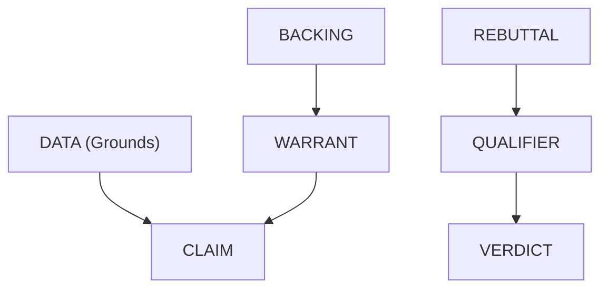

# Toulmini

[](https://toulmini.web.app)
[](https://github.com/Hmbown/Toulmini)
[](https://pypi.org/project/toulmini/)

> "The purpose of an argument is not to establish the truth of a conclusion, but to justify the right to hold it." — Stephen Toulmin, *The Uses of Argument* (1958)

A Logic Harness for arguments. Forces LLMs into structured, sequential reasoning through Toulmin's argumentation model—7 components, 4 phases. Bad logic crashes. Good logic flows.

## What is Toulmin's Model?

Stephen Toulmin's argumentation model breaks reasoning into six interconnected components (plus a final verdict):



| Component | Purpose | Example |
| :--- | :--- | :--- |
| **DATA** | Raw facts/evidence (must be cited) | "Studies show remote workers are 13% more productive" |
| **CLAIM** | Assertion based only on the data | "Remote work increases productivity" |
| **WARRANT** | Logical principle connecting data to claim | "If controlled studies show X, then X is likely true" |
| **BACKING** | Authority supporting the warrant | "Meta-analyses in organizational psychology..." |
| **REBUTTAL** | Conditions where the warrant fails | "Unless the worker lacks a dedicated workspace..." |
| **QUALIFIER** | Degree of certainty | "Presumably" / "Probably" / "Certainly" |
| **VERDICT** | Final synthesis | "SUSTAINED", "OVERRULED", or "REMANDED" |

## Why This Exists

LLMs tend to hedge, compromise, or give "balanced" answers without confronting genuine contradictions. Toulmini forces separation:

*   **No hedging in claims** — qualifiers come later
*   **No skipping steps** — can't render verdict without rebuttal
*   **Hard rejection of weak backing** — stops the chain if support is speculative
*   **Adversarial stress testing** — must find "black swan" edge cases

## Quick Start

### Installation

```bash
# Clone and install
git clone https://github.com/Hmbown/Toulmini.git
cd Toulmini

# With pip
pip install -e .

# Or with uv (faster)
uv pip install -e .
```

### Add to Your MCP Client

*   Claude Code (Recommended)
*   Claude Desktop
*   Gemini CLI
*   Cursor
*   Windsurf

### Verify Installation

```bash
# With MCP Inspector
npx @modelcontextprotocol/inspector python -m toulmini.server

# Or run the built-in verification
python verify_toulmini.py
```

## The 4 Tools

### Phase 1: `initiate_toulmin_sequence`

Starts the analysis. Extracts DATA and constructs CLAIM.

*   **Input:** `query` (str) - "Is this copyright infringement?"
*   **Output:** Structured prompt → JSON with data + claim

### Phase 2: `inject_logic_bridge`

Builds the logical bridge: WARRANT and BACKING.

*   **Input:** `query`, `data_json`, `claim_json`
*   **Output:** Structured prompt → JSON with warrant + backing

> ⚠️ **HARD REJECTION:** If strength == "weak" or "irrelevant", chain terminates.

### Phase 3: `stress_test_argument`

Adversarial attack: REBUTTAL and QUALIFIER.

*   **Input:** `query`, `data_json`, `claim_json`, `warrant_json`, `backing_json`
*   **Output:** Structured prompt → JSON with rebuttal + qualifier

Must find "black swan" scenarios where the warrant fails.

### Phase 4: `render_verdict`

Final judgment on the complete 6-part chain.

*   **Input:** All 6 component JSONs + `query`
*   **Output:** Structured prompt → JSON with verdict

Verdicts: **SUSTAINED** | **OVERRULED** | **REMANDED**

## Example Flow

**Query:** "Would immortality be a curse?"

1.  `initiate_toulmin_sequence(query)`
    *   **DATA:** Terror Management Theory, hedonic adaptation research
    *   **CLAIM:** "Immortality constitutes a psychological curse..."
2.  `inject_logic_bridge(query, data, claim)`
    *   **WARRANT:** "If well-being depends on mortality awareness..."
    *   **BACKING:** Heidegger, Becker, empirical TMT research
    *   **Strength:** "strong" ✓
3.  `stress_test_argument(query, data, claim, warrant, backing)`
    *   **REBUTTAL:** Category error (mortal→immortal psychology)
    *   **QUALIFIER:** "possibly" (45% confidence)
4.  `render_verdict(all_components)`
    *   **VERDICT:** "REMANDED" - insufficient empirical grounding

See `examples/` for complete JSON traces.

## Architectural Constraints

| Constraint | Enforcement |
| :--- | :--- |
| **No external API calls** | Local-only, your LLM only |
| **Strict schemas** | Pydantic validation on all components |
| **Sequential dependencies** | Phase N requires Phases 1..N-1 |
| **JSON-only output** | Prompts forbid conversational responses |
| **Stderr logging** | STDIO-safe (no stdout pollution) |

## Project Structure

```
toulmini/
├── pyproject.toml
├── README.md
├── verify_toulmini.py      # Verification script
├── examples/               # Full reasoning traces
└── src/toulmini/
    ├── __init__.py
    ├── server.py           # MCP entry point (FastMCP)
    ├── prompts.py          # 4 JSON-forcing prompt templates
    └── models/
        ├── __init__.py
        ├── base.py         # Citation, Literal types
        ├── components.py   # 7 Toulmin components
        └── chain.py        # ToulminChain aggregate
```

## Failure Modes

| Condition | Result |
| :--- | :--- |
| `warrant.strength == "weak"` | Chain terminates |
| `backing.strength == "weak"` | Chain terminates |
| `rebuttal.strength == "absolute"` | Verdict must be "overruled" |
| `qualifier.confidence_pct < 30` | Verdict should be "overruled" or "remanded" |
| Missing prior phase output | Tool returns error JSON |

## Inspired By

*   **Hegelion** — Dialectical reasoning (thesis/antithesis/synthesis)
*   Stephen Toulmin, *The Uses of Argument* (1958)

## License

MIT

## Development

### Running Tests

To run the tests, install `pytest` and `mcp[cli]`, then run:

```bash
PYTHONPATH=src pytest
```
