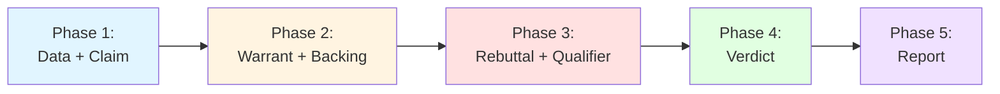
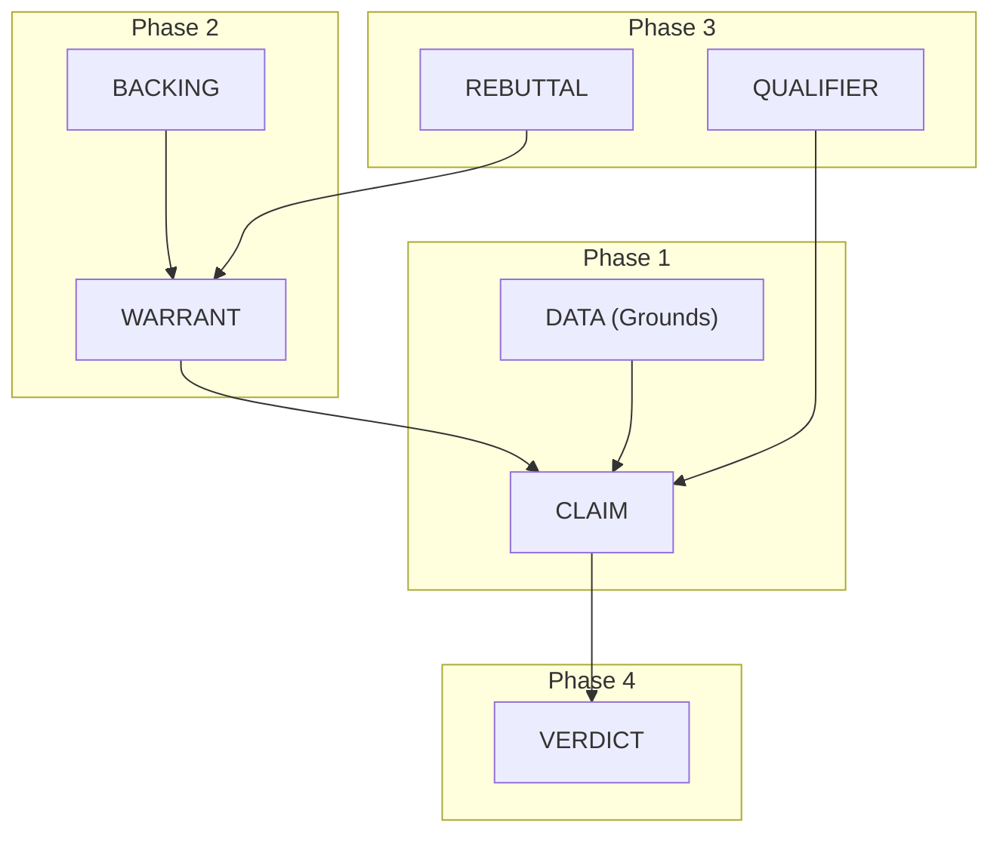

<div align="center">

# 🏛️ Toulmini

**Logic Architecture for Large Language Models**

[](https://pypi.org/project/toulmini/)
[](https://www.python.org/downloads/)
[](https://opensource.org/licenses/MIT)
[](https://modelcontextprotocol.io)
[](https://github.com/Hmbown/Toulmini/actions)

[Website](https://toulmini-web.pages.dev/) • [Documentation](https://github.com/Hmbown/Toulmini/tree/main/docs) • [Examples](https://github.com/Hmbown/Toulmini/tree/main/examples) • [PyPI](https://pypi.org/project/toulmini/)

</div>

---

## 📖 Overview

> *"The purpose of an argument is not to establish the truth of a conclusion, but to justify the right to hold it."*
> — Stephen Toulmin, *The Uses of Argument* (1958)

**Toulmini is a Logic Harness that enforces rigorous argumentation through Stephen Toulmin's model.**

Unlike standard conversational agents that hedge or produce "balanced" summaries, Toulmini forces Large Language Models into structured, sequential reasoning—**7 components across 4 phases**. Weak logic triggers circuit breakers. Strong logic flows through validation. It runs as a standalone MCP server—**no external API keys or cloud calls required.**

### The Problem

LLMs tend to:
- ✗ Produce hedged "balanced" answers without committing to a position
- ✗ Skip logical steps and jump to conclusions
- ✗ Accept weak backing without scrutiny
- ✗ Avoid adversarial self-critique

### The Solution

Toulmini enforces:
- ✓ **Falsifiable claims** with explicit scope (no hedging)
- ✓ **Sequential phase execution** (can't skip to verdict)
- ✓ **Circuit breakers** that crash on weak logic/backing
- ✓ **Mandatory adversarial testing** (Phase 3: destroy your own argument)

**Result:** Scoped, falsifiable claims with explicit confidence levels, backed by citations and stress-tested through rebuttals.

---

## ⚡ Quickstart

### Installation

```bash
pip install toulmini
```

### Configuration

Add Toulmini to your MCP-compatible client:

<details>
<summary><strong>Claude Code (CLI)</strong></summary>

```bash
mcp install toulmini --scope user -- python -m toulmini.server
```

**Verify:**
```bash
mcp list
```
</details>

<details>
<summary><strong>Claude Desktop (macOS/Windows/Linux)</strong></summary>

Add to your `claude_desktop_config.json`:

```json
{
  "mcpServers": {
    "toulmini": {
      "command": "python",
      "args": ["-m", "toulmini.server"]
    }
  }
}
```

**Config locations:**
- **macOS:** `~/Library/Application Support/Claude/claude_desktop_config.json`
- **Windows:** `%APPDATA%\Claude\claude_desktop_config.json`
- **Linux:** `~/.config/Claude/claude_desktop_config.json`

Restart Claude Desktop after editing.
</details>

<details>
<summary><strong>Cursor / Windsurf</strong></summary>

Add to MCP settings:

```json
{
  "toulmini": {
    "command": "python",
    "args": ["-m", "toulmini.server"]
  }
}
```

Restart your IDE.
</details>

### Integrated CLI

Use the bundled CLI after installation for zero-guesswork setup:

```bash
# Run health checks (ensures config + tools are registered)
toulmini-cli --verify

# Inspect the current environment-driven configuration
toulmini-cli --config

# Print the MCP config snippet without writing a file
toulmini-cli --install -

# Write the snippet directly to Claude Desktop's config
# (PYTHONPATH is only added automatically when running from source)
toulmini-cli --install "$HOME/Library/Application Support/Claude/claude_desktop_config.json"
```

`toulmini-setup-mcp` is retained as an alias that maps to the same CLI entry point.
Configuration defaults live in `.env.example` and are documented in `docs/configuration.md`.

### Usage

Once configured, your AI can use Toulmini directly:

```
"Analyze this argument: Should we allow human genetic engineering for enhancement?"
```

Toulmini will automatically execute all 5 phases and present a comprehensive verdict.

**For manual control:**
```
"Use toulmin-help to show me how this works step-by-step"
```

---

## 🎯 What Makes Toulmini Different?

### NOT a Chatbot
Toulmini is a **logic compiler**, not a conversational agent. It:
- Does NOT produce free-form explanations
- Does NOT hedge with "it depends" responses
- Does NOT accept weak reasoning

### IS a Logic Harness
Toulmini:
- **Enforces structure** through 7 Toulmin components
- **Validates rigorously** via Pydantic schemas and custom logic checks
- **Crashes intentionally** when logic is weak (Circuit Breaker pattern)
- **Forces adversarial critique** in Phase 3 (attack your own argument)

### Architecture Guarantees

| Principle | Implementation |
|-----------|----------------|
| **No external API calls** | Runs locally, uses only your LLM |
| **Strict type safety** | Pydantic validation on all components |
| **Sequential enforcement** | Phase N requires Phases 1..N-1 outputs |
| **JSON-only output** | System directive forbids conversational text |
| **Circuit breakers** | Weak warrant/backing → immediate termination |

---

## ✨ Core Features

### 🔗 4-Phase Sequential Execution



Each phase:
- Returns a **strict system directive** (not free-form text)
- Requires **JSON-only output** (validated via Pydantic)
- Depends on **previous phase outputs** (enforced sequentially)

### ⚡ Circuit Breaker System

Toulmini **crashes immediately** if logic fails validation:

```python
# Phase 2 Logic Check (server.py:218-240)
warrant.logic_check()  # Raises if strength == "weak" or "irrelevant"
backing.logic_check()  # Raises if strength == "weak" or "irrelevant"
```

**Result:** No weak arguments reach Phase 3. The chain terminates with `TERMINATION_SIGNAL`.

### 🎭 Adversarial Stress Testing

Phase 3 prompt directive:
> *"You are an adversary. Your job is to DESTROY this argument. Find every weakness. Every edge case. Every 'black swan.'"*

The LLM must:
- List **exceptions** where the warrant fails
- Find **counterexamples** that invalidate the claim
- Assign a **qualifier** based on rebuttal strength

### 🧠 The Council of Experts (Optional)

Convene specialized perspectives before Phase 2 or 3:

```python
consult_field_experts(
    query="Should we allow genetic engineering for enhancement?",
    perspectives=["Bioethicist", "Medical Geneticist", "Disability Rights Advocate"]
)
```

Council output enriches:
- **Phase 2 Backing:** `argument_for` strengthens authority
- **Phase 3 Rebuttals:** `argument_against` seeds exceptions

See [Council Integration Example](examples/council_integration.json) for complete workflow.

### 📚 MCP Resources

- **`toulmin://model`** — Detailed definition of Toulmin's 6 components
- **`toulmin-help`** — Interactive guide to tool usage

---

## 💡 Use Cases

### 🏛️ Rigorous Inquiry
- **Philosophical questions** — "Would immortality be a curse?" "Is free will real?"
- **Contested scientific claims** — "Is nuclear energy safe?"
- **Ethical dilemmas** — "Should we allow genetic enhancement?"

### 🔍 Debate Analysis
Transform heated arguments into structured analysis:
- **Extract the logical structure** of both sides
- **Identify weak backing** that's being taken for granted
- **Surface rebuttals** that haven't been addressed

### 🧪 Self-Reflection
Test your own beliefs before defending them:
- **Claim formulation** — Can you state it without hedging?
- **Backing validation** — Do you have actual authority/evidence?
- **Rebuttal resistance** — What conditions would falsify your view?

### 🤖 AI Output Verification
Use Toulmini to stress-test another LLM's reasoning:
- **Input:** The other model's conclusion
- **Output:** Toulmin analysis revealing logical gaps or weak backing

---

## 📊 Comparison: Single-Call vs. Toulmini

<details>
<summary><strong>Example: "Is remote work more productive?"</strong></summary>

### Raw LLM Response (single prompt):
> "Remote work has both advantages and disadvantages. Some studies show increased productivity, while others highlight challenges with collaboration. It depends on the individual, the role, and the company culture. There's no one-size-fits-all answer."

### Toulmini-Structured Response:

| Component | Output |
|-----------|--------|
| **Data** | Stanford study: 13% productivity increase for call center workers; Microsoft: 10% more meetings for remote workers; Gallup: 54% work longer hours |
| **Claim** | "Remote work increases measurable output for knowledge workers in roles with clearly defined tasks" (scope: limited) |
| **Warrant** | "If workers have fewer interruptions and more autonomy, and tasks have clear deliverables, then output per hour increases" |
| **Backing** | Peer-reviewed economics research (Bloom et al., QJE 2015), NBER working papers |
| **Rebuttal** | Collaboration-heavy roles suffer; junior employees lose mentorship; long-term innovation may differ |
| **Qualifier** | Probably (65% confidence) |
| **Verdict** | **SUSTAINED** — with explicit scope limitations |

### Key Difference
The raw response hedges without committing. Toulmini forces a scoped, falsifiable claim with explicit confidence and acknowledged limitations.

</details>

**Why This Matters:**

- **Single-call approaches** tend toward balanced summaries that hedge competing positions
- **Multi-phase analysis** (Toulmini) surfaces specific claims, cites actual evidence, and produces actionable verdicts
- **Circuit breakers** prevent proceeding with weak reasoning—if the backing is speculative, the chain terminates

---

## 🧩 Toulmin's Model

Stephen Toulmin's argumentation model (1958) breaks reasoning into six interconnected components:



| Component | Purpose | Example ("Is immortality desirable?") |
|-----------|---------|---------------------------------------|
| **DATA** | Raw facts/evidence (must be cited) | "Terror Management Theory shows meaning derives from mortality awareness" |
| **CLAIM** | Assertion based only on the data | "Immortality would constitute a psychological burden" |
| **WARRANT** | Logical principle connecting data to claim | "If well-being depends on mortality awareness, then immortality eliminates flourishing" |
| **BACKING** | Authority supporting the warrant | "Heidegger, Becker, empirical TMT research" |
| **REBUTTAL** | Conditions where the warrant fails | "Unless meaning can arise from sources unrelated to death awareness" |
| **QUALIFIER** | Degree of certainty | "Possibly" (45% confidence) |
| **VERDICT** | Final synthesis | "REMANDED" — insufficient empirical grounding |

---

## 🔧 The 5 Tools

### Phase 1: `initiate_toulmin_sequence`
**Extracts DATA and constructs CLAIM**

- **Input:** `query` (str)
- **Output:** JSON with `data` + `claim`
- **Validation:** Minimum 1 fact, 1 citation; claim must not be a question

### Phase 2: `inject_logic_bridge`
**Builds the logical bridge: WARRANT and BACKING**

- **Input:** `query`, `data_json`, `claim_json`
- **Output:** JSON with `warrant` + `backing`
- ⚠️ **CIRCUIT BREAKER:** If `strength == "weak"` or `"irrelevant"`, chain terminates

### Phase 3: `stress_test_argument`
**Adversarial attack: REBUTTAL and QUALIFIER**

- **Input:** `query`, `data_json`, `claim_json`, `warrant_json`, `backing_json`
- **Output:** JSON with `rebuttal` + `qualifier`
- **Directive:** "You are an adversary. DESTROY this argument."

### Phase 4: `render_verdict`
**Final judgment on the complete argument chain**

- **Input:** All 6 component JSONs + `query`
- **Output:** JSON with `verdict`
- **Verdicts:** `sustained` | `overruled` | `remanded`

### Phase 5: `format_analysis_report` (Optional)
**Transforms JSON into human-readable markdown**

- **Input:** All 7 component JSONs (including verdict) + `query`
- **Output:** Formatted markdown report

---

## 🔬 Execution Flow

Each phase consists of **two distinct steps**:

1. **Tool Call:** MCP server returns a strict system directive (Prompt)
2. **LLM Generation:** LLM follows directive to generate structured JSON

### Example: "Would immortality be a curse?"

#### Phase 1: Grounding
```
Tool Call: initiate_toulmin_sequence(query)

LLM Generates:
  DATA: Terror Management Theory, hedonic adaptation research
  CLAIM: "Immortality constitutes a psychological curse..."
```

#### Phase 2: Logic Bridge
```
Tool Call: inject_logic_bridge(query, data, claim)

LLM Generates:
  WARRANT: "If well-being depends on mortality awareness..."
  BACKING: Heidegger, Becker, empirical TMT research
  Strength Check: "strong" ✓
```

#### Phase 3: Stress Test
```
Tool Call: stress_test_argument(...)

LLM Generates:
  REBUTTAL: Category error (mortal→immortal psychology)
  QUALIFIER: "possibly" (45% confidence)
```

#### Phase 4: Judgment
```
Tool Call: render_verdict(...)

LLM Generates:
  VERDICT: "REMANDED" - insufficient empirical grounding
```

See [examples/](examples/) for complete JSON traces.

---

## ⚠️ Limitations

### Citation Reliability

Toulmini asks LLMs to provide citations with sources and references. However, **without integrated web search**, citations are drawn from the LLM's training data and may be:

- **Outdated** — Training data has a cutoff date
- **Hallucinated** — LLMs can fabricate plausible-sounding citations
- **Incomplete** — URLs may be missing or incorrect

**For reliable citations**, pair Toulmini with an LLM that has web search capabilities (e.g., Claude with web search, GPT with browsing). The prompts ask for URLs only "if known with certainty" to minimize hallucination, but this is not foolproof.

**Bottom line:** Treat citations as *leads to investigate*, not verified sources. Always verify important references independently.

### Failure Modes

| Condition | Result |
|-----------|--------|
| `warrant.strength == "weak"` | Chain terminates (Phase 2) |
| `backing.strength == "weak"` | Chain terminates (Phase 2) |
| `rebuttal.strength == "absolute"` | Verdict must be "overruled" |
| `qualifier.confidence_pct < 30` | Verdict should be "overruled" or "remanded" |
| Missing prior phase output | Tool returns error JSON |

---

## 📁 Project Structure

```
toulmini/
├── pyproject.toml          # Package configuration
├── README.md
├── GEMINI.md               # Agent instructions (v1.1.0+)
├── scripts/
│   └── validate_mcp.py     # Validation script
├── docs/                   # Comprehensive documentation
├── examples/               # Full reasoning traces
│   └── council_integration.json  # Council example (v1.1.0+)
└── src/toulmini/
    ├── __init__.py
    ├── server.py           # MCP entry point (FastMCP)
    ├── prompts.py          # 5 prompt templates
    └── models/
        ├── __init__.py
        ├── base.py         # Citation, Literal types
        ├── components.py   # 7 Toulmin components
        └── chain.py        # ToulminChain aggregate
```

---

## 🧪 Development

### Prerequisites

- Python 3.10+
- `pip` or `uv`

### Install for Development

```bash
git clone https://github.com/Hmbown/Toulmini.git
cd Toulmini
pip install -e .
```

### Run Tests

```bash
PYTHONPATH=src pytest
```

### Run Validation

```bash
python scripts/validate_mcp.py
```

---

## 🤝 Contributing

We welcome contributions! See [CONTRIBUTING.md](CONTRIBUTING.md) for guidelines.

**Key areas for contribution:**
- Additional example traces in `examples/`
- Test coverage improvements
- Documentation enhancements
- Bug reports and feature requests

---

## 🌟 Inspiration

Toulmini is inspired by:

- **[Hegelion](https://github.com/Hmbown/Hegelion)** — Dialectical reasoning engine (Thesis → Antithesis → Synthesis)
- **Stephen Toulmin** — *The Uses of Argument* (1958)

---

## 📄 License

MIT License - see [LICENSE](LICENSE) for details.

---

## 🔗 Links

- **Website:** https://toulmini-web.pages.dev/
- **Documentation:** https://github.com/Hmbown/Toulmini/tree/main/docs
- **PyPI:** https://pypi.org/project/toulmini/
- **GitHub:** https://github.com/Hmbown/Toulmini
- **Issues:** https://github.com/Hmbown/Toulmini/issues

---

<div align="center">

**Built with ❤️ for rigorous reasoning**

[⬆ Back to Top](#-toulmini)

</div>
